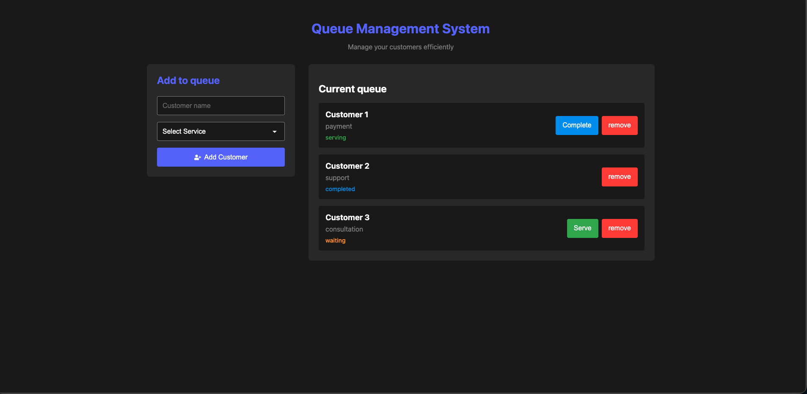

# 📋 Queue Management System

> A streamlined React application to manage customer flow, service requests, and operational status efficiently.


## 📖 About The Project

The **Queue Management System** is a lightweight tool designed to help businesses or service desks manage their waiting lines. It allows operators to add new customers to a queue, assign them specific services (like Consultation, Payment, or Support), and manage their real-time status.

This project showcases the power of **React Hooks** for state management and component composition.

## ✨ Key Features

* **Add Customers:** dynamic form to intake customer names and select service types.
* **Real-time Queue:** Instant updates to the list when a customer is added.
* **Status Management:** Update customer status (e.g., from "Waiting" to "Completed").
* **Remove Entries:** Delete customers from the queue once served.
* **Input Validation:** Prevents empty entries to ensure data integrity.
* **Modern Icons:** Utilizes `react-icons` for a polished UI.

## 📸 Screenshots



## 🛠️ Tech Stack

* **Frontend Library:** [React.js](https://reactjs.org/)
* **Styling:** CSS3
* **Icons:** [React Icons](https://react-icons.github.io/react-icons/)
* **Build Tool:** Vite / Create React App

## 🚀 Getting Started

Follow these instructions to get a copy of the project up and running on your local machine.

### Prerequisites

* Node.js installed on your machine.
* npm or yarn or bun package manager.

### Installation

1.  **Clone the repository**
    ```bash
    git clone [https://github.com/your-username/queue-management-system.git](https://github.com/your-username/queue-management-system.git)
    ```

2.  **Navigate to the project directory**
    ```bash
    cd queue-management-system
    ```

3.  **Install dependencies**
    ```bash
    npm install
    ```

4.  **Start the development server**
    ```bash
    npm run dev
    # or
    npm start
    ```

## 📂 Project Structure

```text
src/
├── components/
│   ├── QueueForm.jsx       # Handles user input and validation
│   └── QueueDisplay.jsx    # Renders the list of customers
├── App.css                 # Global styling
├── App.jsx                 # Main controller and state container
└── main.jsx                # Entry point
